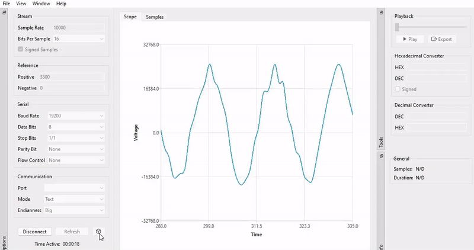

# ADC Converter

Serial plotter and sample analysis software for DSP applications.

**WHAT YOU NEED TO KNOW:** Proof of concept was rapidly developed over the weekend to assess the functionallity of the AV-related Hardware I previously designed - implying that there's some inherent instability to that particular version as A LOT of corners were cut. I didn't want to bother with the actual Software Design, and only needed something that could get a job done, occasional crashes were acceptable to me. Saying that, it's still a better tool than the one provided by Arduino (Plotter) and supports two modes of operation:
  * **text** - allowing you to capture ADC samples sent in the ASCII format followed by the \r\n (typical for Arduino)
  * **binary** - allowing you to capture samples sent in the binary format - which is a primary mode of operation I was looking for since my hardware was based around the 16-bit MCU which simply couldn't handle streaming more than 300 samples per second in the ASCII format

New version is being developed, and you can download to proof of concept by clicking [here](https://github.com/jocic/adc-converter/releases/download/proof-of-concept/proof-of-concept.zip).

## Versioning Scheme

I use a 3-digit [Semantic Versioning](https://semver.org/spec/v2.0.0.html) identifier, for example 1.0.2. These digits have the following meaning:

*   The first digit (1) specifies the MAJOR version number.
*   The second digit (0) specifies the MINOR version number.
*   The third digit (2) specifies the PATCH version number.

## Copyright & License

Copyright (C) 2023 Đorđe Jocić

Licensed under the MIT license.
